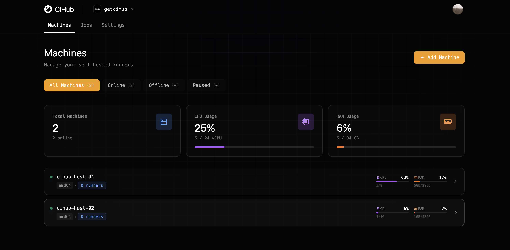

import { Card, CardGrid } from '@astrojs/starlight/components';

Run GitHub Actions on your own hardware — fast, secure, and fully isolated.

CIHub is an open-source, self-hosted GitHub Actions runner orchestrator that delivers enterprise-grade isolation, speed, and control.

## Features

<CardGrid stagger>
  <Card title="Isolation" icon="seti:lock">
    Every job runs in its own ephemeral Firecracker micro-VM. No shared state, no side effects — just a clean sandbox.
  </Card>
  <Card title="Lightning-Fast Execution" icon="rocket">
    Micro-VMs start in milliseconds. Combined with your hardware, jobs run significantly faster than cloud runners.
  </Card>
  <Card title="Integration" icon="puzzle">
    Drop-in replacement for GitHub Actions runners. Use standard workflow syntax with simple labels.
  </Card>
  <Card title="Analytics" icon="setting">
    Built-in dashboard showing real-time job metrics, node health, runner status, and detailed logs.
  </Card>
  <Card title="Scalable" icon="rocket">
    Start with a single machine or grow to a distributed cluster. Orchestrator handles load balancing and scheduling.
  </Card>
</CardGrid>
